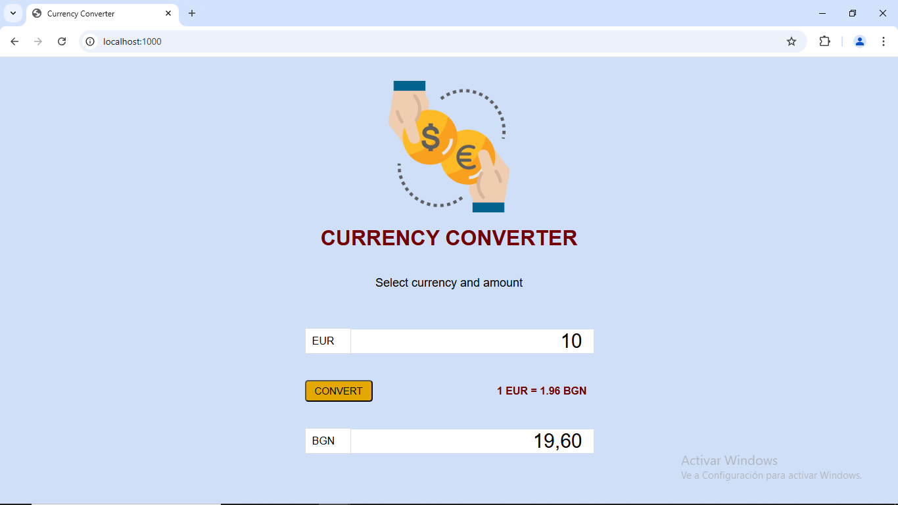
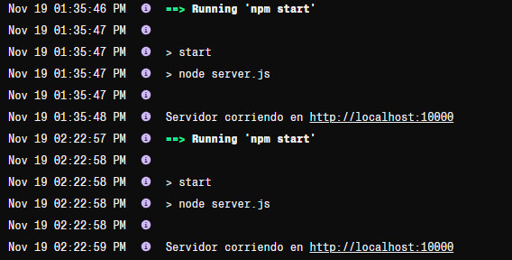
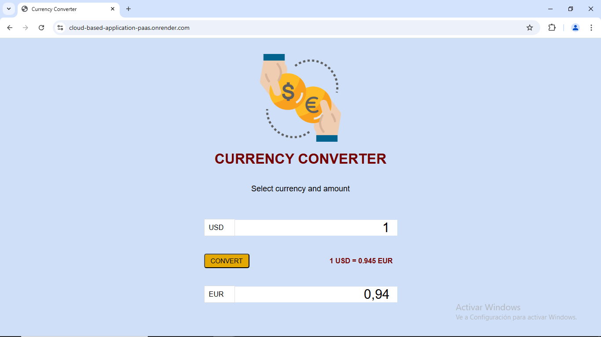

# 💰 Currency Converter Web
---

* This is a web application for converting currencies in real-time. It uses technologies such as HTML, CSS, and JavaScript on the frontend, and Node.js along with Express to create a server that efficiently handles conversions. The application is deployed using the **Render** PaaS, making implementation easy and quick.

🚀 **Technologies Used**
- **Frontend**: HTML, CSS, JavaScript
- **Backend**: Node.js, Express
- **PaaS**: Render

### 📖 How to Use
---

* To run the project on a local machine, follow these steps:

#### **Clone the Repository**

```
git clone https://github.com/ciizao/Cloud-Based-Application-PaaS.git
```

* After cloning the repository, make sure to install the dependencies by running the `npm install` command. Then, start the server using `npm start`. Once the server is running, it will be listening on port `1000`. To access the application, open your browser and go to `http://localhost:1000`.



### 🌐 Deployment on Render
---

* The application is deployed on the **Render** platform. You can access the application at the following link:

[Link](https://jsproyectdocker-production.up.railway.app "click to visit")

##### ✅ **Deployment Logs**

* Below are the logs confirming the successful deployment of the application.



##### 🖼 **Deployment**
* Functionality of the application running on Render.



### 📂 Repository
* The source code for this project is available on GitHub:

```
https://github.com/ciizao/Cloud-Based-Application-PaaS.git
```